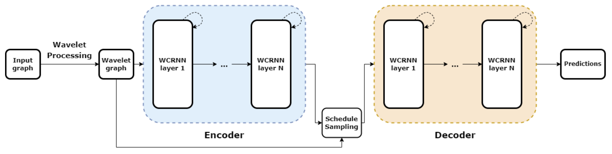

# Fast Temporal Wavelet Graph Neural Networks



Paper: https://arxiv.org/pdf/2302.08643.pdf

Contributors:
* Nguyen Duc Thien
* Nguyen Manh Duc Tuan
* Hy Truong Son (Correspondent / PI)

Implementation of Multiresolution Matrix Factorization (MMF) and graph wavelet computation from (Hy and Kondor, 2021) https://proceedings.mlr.press/v196/hy22a.html is publicly available at: https://github.com/risilab/Learnable_MMF

* Experiments for brain networks: ```brain-networks/```
* Experiments for traffic prediction: ```traffic-prediction/```
